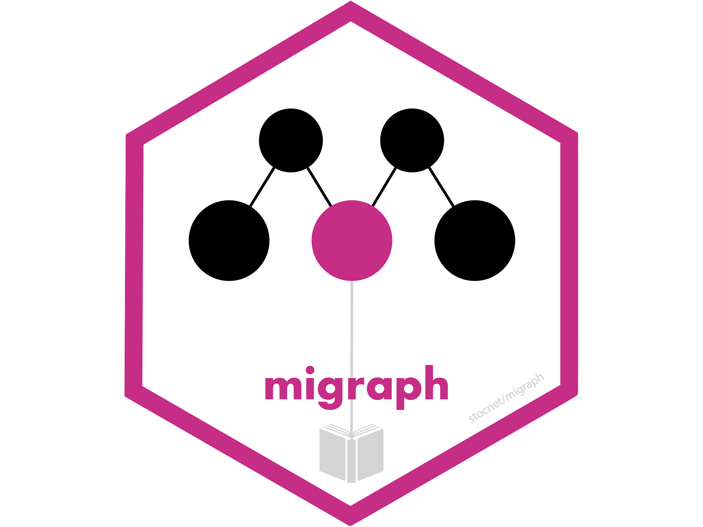
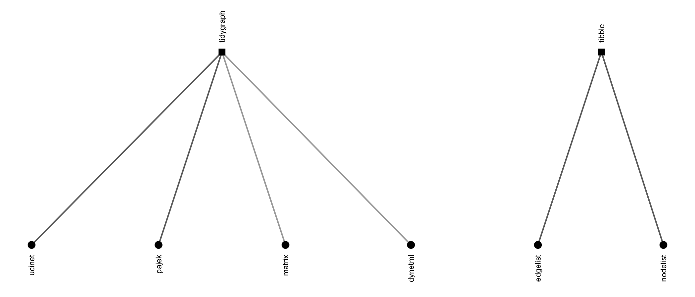

<!-- README.md is generated from README.Rmd. Please edit that file -->

# migraph 

<!-- badges: start -->

[](https://lifecycle.r-lib.org/articles/stages.html#maturing)
 

[](https://app.codecov.io/gh/snlab-ch/migraph?branch=main)
[](https://www.codefactor.io/repository/github/snlab-ch/migraph)
[](https://bestpractices.coreinfrastructure.org/projects/4559)
[](https://doi.org/10.5281/zenodo.7076396)
<!-- see https://zenodo.org/record/7076396 -->
<!--  -->
<!-- badges: end -->

## About the package

`{migraph}` works with and extends existing network analysis packages
for analysing multimodal networks. It provides a common, standard syntax
for working with and analysing both one-mode and two-mode networks.


The package is intended as a software companion to the book:

> David Knoke, Mario Diani, James Hollway, and Dimitris Christopoulos
> (2021) [*Multimodal Political
> Networks*](https://www.cambridge.org/core/books/multimodal-political-networks/43EE8C192A1B0DCD65B4D9B9A7842128).
> Cambridge University Press: Cambridge.

Most datasets used in the book are included in this package, and the
package implements most methods discussed in the book. Since many of
theses datasets and routines are discussed and analysed more there, if
you like the package please check out the book, and vice versa.

## How does migraph help?

`{migraph}` can help with many network analytic tasks, including Making
and Manipulating network data, Marking and Measuring nodes, ties, and
networks, calculating Motifs and identifying Memberships, as well as
Modelling and Mapping.

### Making network data

#### Including network data

`{migraph}` includes a number of prominent network datasets, especially
multimodal and multiplex examples for demonstrating more advanced
methods.

- `mpn_bristol`, `mpn_cow_igo`, `mpn_cow_trade`, `mpn_DE_1990`,
  `mpn_DE_2008`, `mpn_DemSxP`, `mpn_elite_mex`, `mpn_elite_usa_advice`,
  `mpn_elite_usa_money`, `mpn_IT_1990`, `mpn_IT_2008`, `mpn_OverSxP`,
  `mpn_RepSxP`, `mpn_ryanair`, `mpn_UK_1990`, `mpn_UK_2008`
- `ison_adolescents`, `ison_algebra`, `ison_bb`, `ison_bm`,
  `ison_brandes`, `ison_brandes2`, `ison_karateka`, `ison_lotr`,
  `ison_marvel_relationships`, `ison_marvel_teams`, `ison_mb`,
  `ison_mm`, `ison_networkers`, `ison_southern_women`

#### Importing network data

If that’s not enough, `{migraph}` offers a number of options for
importing network data found in other repositories. `{migraph}` can
import and export to Excel edgelists and nodelists,
[UCINET](http://www.analytictech.com/archive/ucinet.htm),
[Pajek](http://mrvar.fdv.uni-lj.si/pajek/), and
[DynetML](http://casos.cs.cmu.edu/projects/dynetml/) files, e.g.:



- `read_dynetml()`, `read_edgelist()`, `read_matrix()`,
  `read_nodelist()`, `read_pajek()`, `read_ucinet()`
- `write_edgelist()`, `write_nodelist()`, `write_pajek()`,
  `write_ucinet()`

#### Inventing network data

`{migraph}` includes algorithms for making networks with particular
properties. The `create_*` group of functions create networks with a
particular structure, e.g.:

- `create_complete()`, `create_components()`, `create_core()`,
  `create_empty()`, `create_lattice()`, `create_ring()`,
  `create_star()`, `create_tree()`

The `generate_*` group of functions generate networks from particular
generative mechanisms, e.g.:

- `generate_permutation()`, `generate_random()`, `generate_scalefree()`,
  `generate_smallworld()`

Note that all these functions work to create two-mode networks as well
as one-mode versions.

### Manipulating network data

In addition to functions that help add elements to or extract elements
from a network, `{migraph}` also includes functions for coercing and
changing network data.

#### Coercing network data

Once network data is in R, `{migraph}`’s `as_*()` functions can be used
to translate objects from one of the above classes into any other, and
include:


These functions are designed to be as intuitive and lossless as
possible, outperforming many other class-coercion packages.

We use these functions internally in every `{migraph}` function to (1)
allow them to be run on any compatible network format and (2) use the
most efficient algorithm available. This makes `{migraph}` compatible
with your existing workflow, whether you use base R matrices or
edgelists as data frames, [`{igraph}`](https://igraph.org/r/),
[`{network}`](https://statnet.org), or
[`{tidygraph}`](https://tidygraph.data-imaginist.com/index.html), and
extensible by developments in those other packages too.

#### Changing network data

`{migraph}`’s `to_*()` functions can be used on any class object to
reformat, transform, or split networks into networks with other
properties, e.g.:

- `to_anti()`, `to_blocks()`, `to_components()`, `to_edges()`,
  `to_egos()`, `to_giant()`, `to_main_component()`, `to_matching()`,
  `to_mode1()`, `to_mode2()`, `to_multilevel()`, `to_named()`,
  `to_onemode()`, `to_redirected()`, `to_simplex()`, `to_subgraph()`,
  `to_subgraphs()`, `to_ties()`, `to_twomode()`, `to_undirected()`,
  `to_uniplex()`, `to_unnamed()`, `to_unsigned()`, `to_unweighted()`

Reformatting means changing the format of the network, e.g. from
directed to undirected via `to_undirected()`. Transforming means
changing the dimensions of the network, e.g. from a two-mode network to
a one-mode projection via `to_mode1()`. Splitting means separating a
network, e.g. from a whole network to the various ego networks via
`to_egos()`. Those functions that split a network into a list of
networks are distinguishable as those `to_*()` functions that are named
in the plural.

### Marks and Measures

`{migraph}` offers a range of measures and models with sensible
defaults. Many wrap existing functions in common packages for use with
one-mode networks, but extend these to treat and/or normalise for
two-mode (and sometimes three-mode) networks correctly. Functions are
given intuitive and succinct names that avoid conflicts with existing
function names wherever possible.

#### Marking networks

`{migraph}`’s `*is_*()` functions offer fast logical tests of various
properties. Whereas `is_*()` returns a single logical value for the
network, `node_is_*()` returns a logical vector the length of the number
of nodes in the network, and `tie_is_*()` returns a logical vector the
length of the number of ties in the network.

- `is_acyclic()`, `is_aperiodic()`, `is_bipartite()`, `is_complex()`,
  `is_connected()`, `is_directed()`, `is_edgelist()`, `is_eulerian()`,
  `is_graph()`, `is_labelled()`, `is_migraph()`, `is_multiplex()`,
  `is_perfect_matching()`, `is_signed()`, `is_twomode()`,
  `is_uniplex()`, `is_weighted()`
- `node_is_core()`, `node_is_cutpoint()`, `node_is_isolate()`,
  `node_is_max()`, `node_is_min()`, `node_is_random()`
- `tie_is_bridge()`, `tie_is_loop()`, `tie_is_max()`, `tie_is_min()`,
  `tie_is_multiple()`, `tie_is_reciprocated()`

The `*is_max()` and `*is_min()` functions are used to identify the
maximum or minimum, respectively, node or tie according to some measure
(see below).

#### Measuring networks

`{migraph}` offers a large and growing smorgasbord of measures that can
be used at the node, tie, and network level. Each recognises whether the
network is directed or undirected, weighted or unweighted, one-mode or
two-mode. All return normalized values wherever possible, though this
can be overrided. Here are some examples:

- *Centrality*: `node_degree()`, `node_closeness()`,
  `node_betweenness()`, and `node_eigenvector()`
- *Centralization*: `network_degree()`, `network_closeness()`,
  `network_betweenness()`, and `network_eigenvector()`
- *Cohesion*: `network_density()`, `network_reciprocity()`,
  `network_transitivity()`, `network_equivalency()`, and
  `network_congruency()`
- *Connectedness*: `network_components()`, `network_cohesion()`,
  `network_adhesion()`, `network_diameter()`, `network_length()`
- *Diversity*: `network_diversity()`, `network_homophily()`,
  `network_assortativity()`, `node_diversity()`, `node_homophily()`,
  `node_assortativity()`, `node_richness()`
- *Innovation*: e.g. `node_redundancy()`, `node_effsize()`,
  `node_efficiency()`, `node_constraint()`, `node_hierarchy()`
- *Topological features*: e.g. `network_core()`, `network_factions()`,
  `network_modularity()`, `network_smallworld()`, `network_balance()`

Please explore [the list of
functions](https://snlab-ch.github.io/migraph/reference/index.html) to
find out more.

### Motifs and Memberships

The package also include functions for returning various censuses at the
network or node level, e.g.:

- `network_brokerage_census()`, `network_dyad_census()`,
  `network_mixed_census()`, `network_triad_census()`
- `node_brokerage_census()`, `node_path_census()`, `node_quad_census()`,
  `node_tie_census()`, `node_triad_census()`

These can be analysed alone, or used as a profile for establishing
equivalence. `{migraph}` offers both HCA and CONCOR algorithms, as well
as elbow, silhouette, and strict methods for *k*-cluster selection.

- `node_automorphic_equivalence()`, `node_equivalence()`,
  `node_regular_equivalence()`, `node_structural_equivalence()`

`{migraph}` also includes functions for establishing membership on other
bases, such as typical community detection algorithms, as well as
component and core-periphery partitioning algorithms.

### Models

All measures can be tested against conditional uniform graph (CUG) or
quadratic assignment procedure (QAP) distributions using:

- `test_permutation()`, `test_random()`

Hypotheses can also be tested within multivariate models via multiple
(linear or logistic) regression QAP:

- `network_reg()`

`{migraph}` is the only package that offers these testing frameworks for
two-mode networks as well as one-mode networks.

Lastly, `{migraph}` also includes functions for simulating diffusion or
learning processes over a given network:

- `play_diffusion()`, `play_diffusions()`, `play_learning()`

The diffusion models include not only SI and threshold models, but also
SIS, SIR, SIRS, SIER, and SIERS.

Plot methods for all outputs assist with interpretation and
communication.

### Mapping

Besides intuitive `plot()` methods for most of the above outputs,
`{migraph}` also includes `autographr()` for one-line plotting graphs
with sensible defaults based on their properties. `{migraph}` uses the
excellent `{ggraph}` package (and thus `{ggplot2}`) as a plotting
engine. This also makes extending and theming default output easy, and
`{patchwork}` is used to help arrange individual plots together.

In addition, `{migraph}` offers some additional layout algorithms for
snapping layouts to a grid or visualising partitions horizontally,
vertically, or concentrically. The following figures illustrate the
difference in results over `{igraph}`:


## Installation

### Stable

The easiest way to install the latest stable version of `{migraph}` is
via CRAN. Simply open the R console and enter:

`install.packages('migraph')`

You can then begin to use `{migraph}` by loading the package:

`library(migraph)`

This will load any required packages and make the data contained within
the package available. The version from CRAN also has all the vignettes
built and included. You can check them out with:

`vignettes(package = "migraph")`

### Development

For the latest development version, for slightly earlier access to new
features or for testing, you may wish to download and install the
binaries from Github or install from source locally.

The latest binary releases for all major OSes – Windows, Mac, and Linux
– can be found
[here](https://github.com/snlab-ch/migraph/releases/latest). Download
the appropriate binary for your operating system, and install using an
adapted version of the following commands:

- For Windows:
  `install.packages("~/Downloads/migraph_winOS.zip", repos = NULL)`
- For Mac:
  `install.packages("~/Downloads/migraph_macOS.tgz", repos = NULL)`
- For Unix:
  `install.packages("~/Downloads/migraph_linuxOS.tar.gz", repos = NULL)`

To install from source the latest main version of `{migraph}` from
Github, please install the `{remotes}` or `{devtools}` package from CRAN
and then:

- For latest stable version:
  `remotes::install_github("snlab-ch/migraph", build_vignettes = TRUE)`
- For latest development version:
  `remotes::install_github("snlab-ch/migraph@develop", build_vignettes = TRUE)`

### Tutorials

This package has recently moved away from the use of vignettes, in
favour of smaller and more interactive `{learnr}` tutorials. Since
version 0.12.3, many of the previous vignettes are instead available as
tutorials, more will be converted soon, and those that have been
converted will continue to be updated and enriched.

To access the tutorials, you will need to have the additional package
`{learnr}` installed: `install.packages("learnr")`. Then we would first
suggest that you check to see which vignettes are currently available:

``` r
learnr::available_tutorials("migraph")
#> Available tutorials:
#> * migraph
#>   - tutorial2 : "Visualisation"
#>   - tutorial3 : "Centrality"
#>   - tutorial4 : "Community"
#>   - tutorial5 : "Equivalence"
#>   - tutorial6 : "Topology"
#>   - tutorial7 : "Diffusion"
#>   - tutorial8 : "Regression"
```

You can then choose to begin a tutorial using the following command:
e.g. `learnr::run_tutorial("tutorial2", "migraph")`. For more details on
the `{learnr}` package, see [here](https://rstudio.github.io/learnr/).

## Relationship to other packages

It draws together, updates, and builds upon many functions currently
available in other excellent R packages such as
[`{bipartite}`](https://github.com/biometry/bipartite),
[`{multinet}`](https://CRAN.R-project.org/package=multinet), and
[`{tnet}`](https://toreopsahl.com/tnet/), and implements many additional
features currently only available outside the R ecosystem in packages
such as
[**UCINET**](https://sites.google.com/site/ucinetsoftware/download?authuser=0).

## Funding details

Subsequent work on this package has been funded by the Swiss National
Science Foundation (SNSF) [Grant Number
188976](https://data.snf.ch/grants/grant/188976): “Power and Networks
and the Rate of Change in Institutional Complexes” (PANARCHIC).
