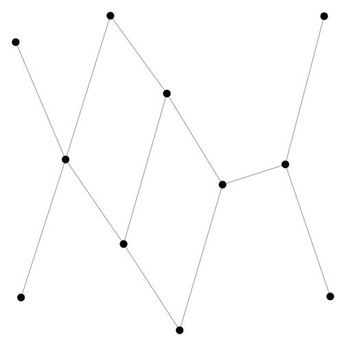
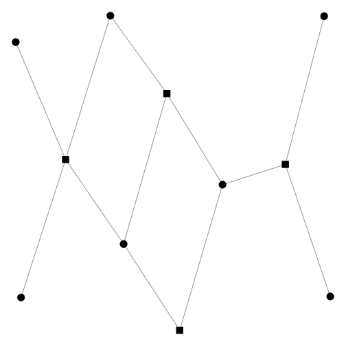
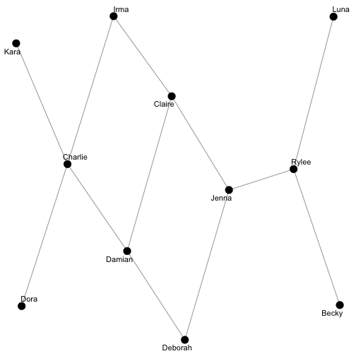
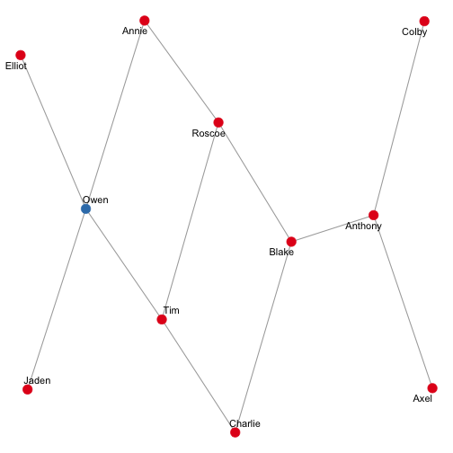
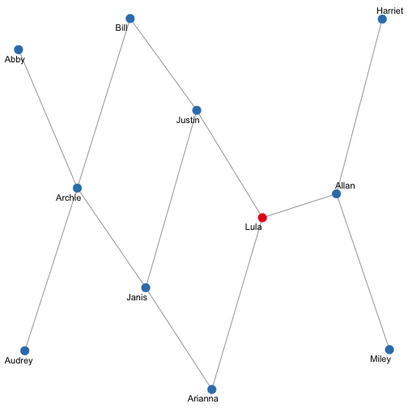
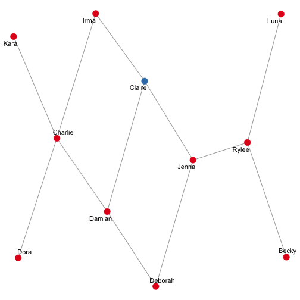
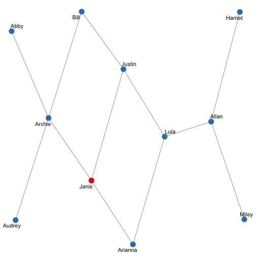
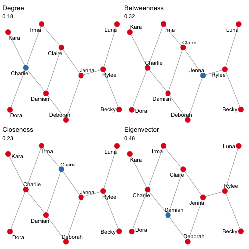

# Calculating different centrality measures

For this exercise, we'll use the `ison_brandes` and `ison_brandes2` datasets.
The `ison_brandes2` is a two-mode version of the `ison_brandes` dataset.
This dataset is in a 'tidygraph' format, 
but migraph makes it easy to coerce this into other forms
to be compatible with other packages.


```r
library(migraph)
autographr(ison_brandes)
```



```r
autographr(ison_brandes2)
```



```r
(mat <- as_matrix(ison_brandes))
#>       [,1] [,2] [,3] [,4] [,5] [,6] [,7]
#>  [1,]    0    0    1    0    0    0    0
#>  [2,]    0    0    1    0    0    0    0
#>  [3,]    1    1    0    1    0    0    0
#>  [4,]    0    0    1    0    1    1    0
#>  [5,]    0    0    0    1    0    0    1
#>  [6,]    0    0    0    1    0    0    1
#>  [7,]    0    0    0    0    1    1    0
#>  [8,]    0    0    0    0    0    1    0
#>  [9,]    0    0    0    0    0    0    1
#> [10,]    0    0    0    0    0    0    0
#> [11,]    0    0    0    0    0    0    0
#>       [,8] [,9] [,10] [,11]
#>  [1,]    0    0     0     0
#>  [2,]    0    0     0     0
#>  [3,]    0    0     0     0
#>  [4,]    0    0     0     0
#>  [5,]    0    0     0     0
#>  [6,]    1    0     0     0
#>  [7,]    0    1     0     0
#>  [8,]    0    1     0     0
#>  [9,]    1    0     1     1
#> [10,]    0    1     0     0
#> [11,]    0    1     0     0
```

The network is anonymous, but I think it would be nice to add some names,
even if it's just pretend. 
Luckily, `{migraph}` has a function for this.
This makes plotting the network just a wee bit more accessible and interpretable:


```r
ison_brandes <- to_named(ison_brandes)
ison_brandes2 <- to_named(ison_brandes2)
autographr(ison_brandes)
```



Note that you will likely get a different set of names,
as they are assigned randomly from a pool of (American) first names.

Let's start with calculating degree, as it is easy to calculate yourself.
Just sum the rows or columns of the matrix!


```r
(degrees <- rowSums(mat))
#>  [1] 1 1 3 3 2 3 3 2 4 1 1
rowSums(mat) == colSums(mat)
#>  [1] TRUE TRUE TRUE TRUE TRUE TRUE TRUE
#>  [8] TRUE TRUE TRUE TRUE
# Are they all equal? Why?
# You can also just use a built in command in migraph though:
node_degree(ison_brandes, normalized = FALSE)
#>   Kelly Bentley Clifford  Lily  Ivan Debra
#> 1     1       1        3     3     2     3
#> # ... with 5 more from this nodeset in the vector.
```

Often we are interested in the distribution of (degree) centrality in a network.
`{migraph}` offers a way to get a pretty good first look at this distribution,
though there are more elaborate ways to do this in base and grid graphics.


```r
plot(node_degree(ison_brandes), "h") +
  plot(node_degree(ison_brandes), "d")
```


Other measures of centrality can be a little trickier to calculate by hand.
Fortunately, we can use functions from `{migraph}` to help:


```r
node_betweenness(ison_brandes)
#>   Kelly Bentley Clifford  Lily  Ivan Debra
#> 1     0       0    0.378 0.485 0.133 0.337
#> # ... with 5 more from this nodeset in the vector.
node_closeness(ison_brandes)
#>   Kelly Bentley Clifford  Lily  Ivan Debra
#> 1 0.278   0.278    0.370 0.455 0.435 0.476
#> # ... with 5 more from this nodeset in the vector.
node_eigenvector(ison_brandes)
#>   Kelly Bentley Clifford  Lily  Ivan Debra
#> 1 0.106   0.106    0.277 0.510 0.437 0.615
#> # ... with 5 more from this nodeset in the vector.
# TASK: Can you create degree distributions for each of these?
```

Note that all centrality measures in `{migraph}` return normalized
scores by default -- 
for the raw scores, just add `normalized = FALSE` as an extra argument.

# Plotting different centrality measures

It is straightforward in `{migraph}` to highlight nodes and ties 
with maximum or minimum (e.g. degree) scores.
If the vector is numeric (i.e. a "measure"),
then this can be easily converted into a logical vector that
identifies the node/tie with the maximum/minimum score using
e.g. `node_is_max()` or `tie_is_min()`.
By passing this attribute to the `autographr()` argument "node_color"
we can highlight which node or nodes hold the maximum score in red.


```r
ison_brandes %>%
  add_node_attribute("color", node_is_max(node_degree(ison_brandes))) %>%
  autographr(node_color = "color")
```



```r
ison_brandes %>%
  add_node_attribute("color", node_is_max(node_betweenness(ison_brandes))) %>%
  autographr(node_color = "color")
```



```r
ison_brandes %>%
  add_node_attribute("color", node_is_min(node_closeness(ison_brandes))) %>%
  autographr(node_color = "color")
```



```r
ison_brandes %>%
  add_node_attribute("color", node_is_min(node_eigenvector(ison_brandes))) %>%
  autographr(node_color = "color")
```



How neat! Try it with the two-mode version.
What can you see?

# Calculating centralization

`{migraph}` also implements centralization functions.
Here we are no longer interested in the level of the node,
but in the level of the whole graph, so the syntax is:


```r
graph_degree(ison_brandes)
#> [1] 0.182
graph_betweenness(ison_brandes)
#> [1] 0.318
graph_closeness(ison_brandes)
#> [1] 0.23
graph_eigenvector(ison_brandes)
#> [1] 0.484
```

By default, scores are printed to 3 decimal places,
but this can be modified and, in any case, 
the unrounded values are retained internally and passed on.

Note that for centralization in two-mode networks,
two values are given (as a named vector),
since normalization typically depends on the (asymmetric)
number of nodes in each mode.

What if we want to have a single image/figure with multiple plots?
This can be a little tricky with gg-based plots,
but fortunately the `{patchwork}` package is here to help.


```r
ison_brandes <- ison_brandes %>%
  add_node_attribute("degree", node_is_max(node_degree(ison_brandes))) %>%
  add_node_attribute("betweenness", node_is_max(node_betweenness(ison_brandes))) %>%
  add_node_attribute("closeness", node_is_max(node_closeness(ison_brandes))) %>%
  add_node_attribute("eigenvector", node_is_max(node_eigenvector(ison_brandes)))
gd <- autographr(ison_brandes, node_color = "degree") + 
  ggtitle("Degree", subtitle = round(graph_degree(ison_brandes), 2))
gc <- autographr(ison_brandes, node_color = "closeness") + 
  ggtitle("Closeness", subtitle = round(graph_closeness(ison_brandes), 2))
gb <- autographr(ison_brandes, node_color = "betweenness") + 
  ggtitle("Betweenness", subtitle = round(graph_betweenness(ison_brandes), 2))
ge <- autographr(ison_brandes, node_color = "eigenvector") + 
  ggtitle("Eigenvector", subtitle = round(graph_eigenvector(ison_brandes), 2))
(gd | gb) / (gc | ge)
```



```r
# ggsave("brandes-centralities.pdf")
```

# Tasks
1. Try this with the `ison_brandes2` dataset in the package.

2. Name a plausible research question you could ask of this data
for each of the four main centrality measures
(degree, betweenness, closeness, eigenvector)
You may want to add these as titles or subtitles to each plot.

3. How centralized is the network?
