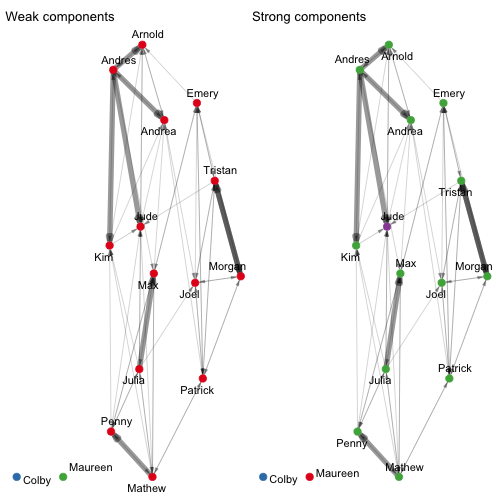
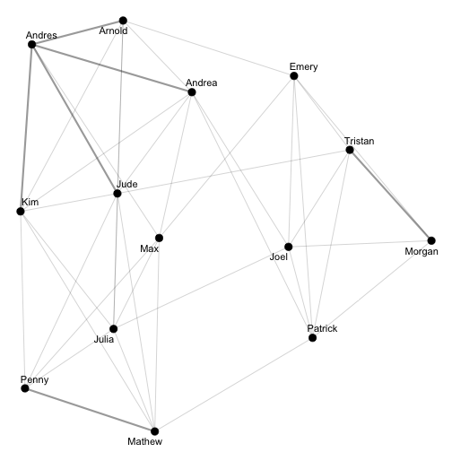
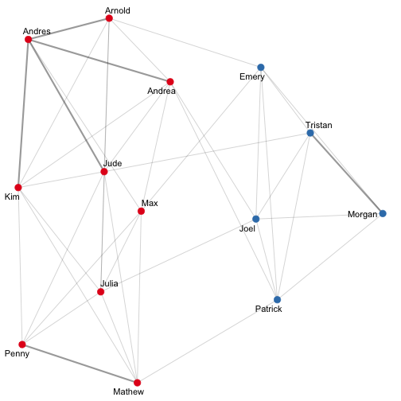
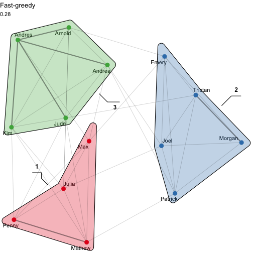
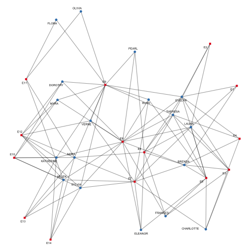
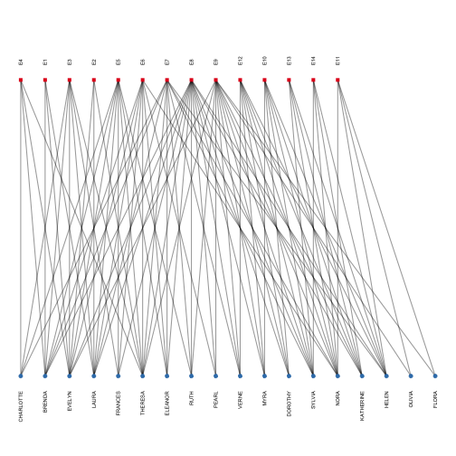
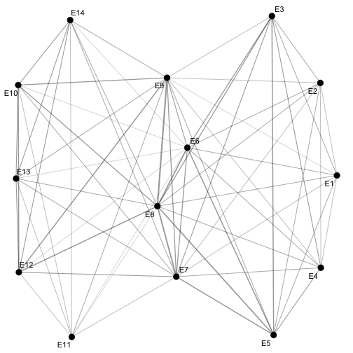
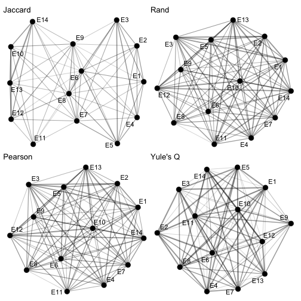

# Working with Multiplex Networks

The data we're going to use here is included in the `{migraph}` package.
This dataset is multiplex, meaning that it contains 
several different types of ties: friendship, social and task interactions.


```r
# library(migraph)
data("ison_algebra", package = "migraph")
# ?migraph::ison_algebra
```

Note that you do not need to load the package using `library()` to get the data,
but you probably want to load it all the same so that you have access to all the functions.
Now you know how to create new matrices in R, load .csv files, 
saved .RData files, and data from packages!

The network is anonymous, but I think it would be nice to add some names,
even if it's just pretend. 
Luckily, `{migraph}` has a function for this.
This makes plotting the network just a wee bit more accessible and interpretable:


```r
ison_algebra <- to_named(ison_algebra)
autographr(ison_algebra)
```


Note that you will likely get a different set of names,
as they are assigned randomly from a pool of (American) first names.

As a multiplex network, 
there are actually three different types of tie in this network.
We can extract them and investigate them separately using `to_uniplex()`:


```r
(friends <- to_uniplex(ison_algebra, "friends"))
#> # A tbl_graph: 16 nodes and 62 edges
#> #
#> # A directed simple graph with 3 components
#> #
#> # Node Data: 16 × 1 (active)
#>   name   
#>   <chr>  
#> 1 Jude   
#> 2 Tristan
#> 3 Max    
#> 4 Colby  
#> 5 Mathew 
#> 6 Julia  
#> # … with 10 more rows
#> #
#> # Edge Data: 62 × 3
#>    from    to weight
#>   <int> <int>  <dbl>
#> 1     2     1      1
#> 2     2     7      1
#> 3     2     8      1
#> # … with 59 more rows
gfriend <- autographr(friends) + ggtitle("Friendship")
(social <- to_uniplex(ison_algebra, "social"))
#> # A tbl_graph: 16 nodes and 129 edges
#> #
#> # A directed simple graph with 1 component
#> #
#> # Node Data: 16 × 1 (active)
#>   name   
#>   <chr>  
#> 1 Jude   
#> 2 Tristan
#> 3 Max    
#> 4 Colby  
#> 5 Mathew 
#> 6 Julia  
#> # … with 10 more rows
#> #
#> # Edge Data: 129 × 3
#>    from    to weight
#>   <int> <int>  <dbl>
#> 1     1     5   1.2 
#> 2     1     8   0.15
#> 3     1     9   2.85
#> # … with 126 more rows
gsocial <- autographr(social) + ggtitle("Social")
(tasks <- to_uniplex(ison_algebra, "tasks"))
#> # A tbl_graph: 16 nodes and 88 edges
#> #
#> # A directed simple graph with 1 component
#> #
#> # Node Data: 16 × 1 (active)
#>   name   
#>   <chr>  
#> 1 Jude   
#> 2 Tristan
#> 3 Max    
#> 4 Colby  
#> 5 Mathew 
#> 6 Julia  
#> # … with 10 more rows
#> #
#> # Edge Data: 88 × 3
#>    from    to weight
#>   <int> <int>  <dbl>
#> 1     1     5    0.3
#> 2     1     9    0.3
#> 3     1    10    0.3
#> # … with 85 more rows
gtask <- autographr(tasks) + ggtitle("Task")
gfriend + gsocial + gtask
```


Note also that these are weighted networks.
`autographr()` automatically registers these different weights and plots them.

# Cohesion

Let's concentrate on the task network for now and calculate a few basic
measures of cohesion: density, reciprocity, transitivity, and components.

## Density

Because this is a directed network, we can calculate the density as:


```r
network_ties(tasks)/(network_nodes(tasks)*(network_nodes(tasks)-1))
#> [1] 0.3666667
```

but we can also just use the `{migraph}` function...


```r
network_density(tasks)
#> [1] 0.367
```

Note that the various measures in `{migraph}` print results to three decimal points
by default, but the underlying result retains the same recurrence.
So same result... Is this high or low?

## Closure

Next let's calculate reciprocity.


```r
network_reciprocity(tasks)
#> [1] 0.932
```

And let's calculate transitivity.


```r
network_transitivity(tasks)
#> [1] 0.568
```

What can we say about task closure in this network?
Would we expect it to be higher or lower than for `social`?
Is it?

## Components

Now let's look at the friend network.


```r
network_components(friends)
#> [1] 4
network_components(to_undirected(friends))
#> [1] 3
```

How many components are there? Why are the results different?
 
We can use the membership vector in the resulting object to color nodes:


```r
friends <- friends %>% 
  mutate(weak_comp = node_components(to_undirected(friends)),
         strong_comp = node_components(friends))
autographr(friends, node_color = "weak_comp") + ggtitle("Weak components") +
autographr(friends, node_color = "strong_comp") + ggtitle("Strong components")
```



# Community Detection

Ok, the friendship network has 3-4 components, but how many 'groups' are there?
Just visually, it looks like there are two denser clusters within the main component.

Today we'll use the friend subgraph for exploring community detection methods.
For clarity and simplicity, 
we will concentrate on the main component (the so-called 'giant' component)
and consider friendship undirected:


```r
(friends <- to_giant(friends))
#> # A tbl_graph: 14 nodes and 62 edges
#> #
#> # A directed simple graph with 1 component
#> #
#> # Node Data: 14 × 3 (active)
#>   name    weak_comp strong_comp
#>   <chr>       <dbl>       <dbl>
#> 1 Jude            1           4
#> 2 Tristan         1           3
#> 3 Max             1           3
#> 4 Mathew          1           3
#> 5 Julia           1           3
#> 6 Joel            1           3
#> # … with 8 more rows
#> #
#> # Edge Data: 62 × 3
#>    from    to weight
#>   <int> <int>  <dbl>
#> 1     2     1      1
#> 2     2     6      1
#> 3     2     7      1
#> # … with 59 more rows
(friends <- to_undirected(friends))
#> # A tbl_graph: 14 nodes and 42 edges
#> #
#> # An undirected simple graph with 1 component
#> #
#> # Node Data: 14 × 3 (active)
#>   name    weak_comp strong_comp
#>   <chr>       <dbl>       <dbl>
#> 1 Jude            1           4
#> 2 Tristan         1           3
#> 3 Max             1           3
#> 4 Mathew          1           3
#> 5 Julia           1           3
#> 6 Joel            1           3
#> # … with 8 more rows
#> #
#> # Edge Data: 42 × 3
#>    from    to weight
#>   <int> <int>  <dbl>
#> 1     1     2      1
#> 2     1     4      1
#> 3     3     4      1
#> # … with 39 more rows
autographr(friends)
```



Comparing `friends` before and after these operations, 
you'll notice the number of ties decreases as reciprocated directed ties
are consolidated into single undirected ties, 
and the number of nodes decreases as the couple of isolates are removed.

There is no one single best community detection algorithm. 
Instead there are several, each with their strengths and weaknesses. 
Since this is a rather small network, we'll focus on the following methods: 
walktrap, edge betweenness, and fast greedy.
`{igraph}` also includes others though too; all are named cluster_...
As you use them, consider how they portray clusters and consider which one(s) 
afford a sensible view of the social world as cohesively organized.

## Walktrap

This algorithm detects communities through a series of short random walks, 
with the idea that nodes encountered on any given random walk 
are more likely to be within a community than not.
It was proposed by Pons and Latapy (2005).

The algorithm initially treats all nodes as communities of their own, then 
merges them into larger communities, still larger communities, and so on.
In each step a new community is created from two other communities, 
and its ID will be one larger than the largest community ID so far. 
This means that before the first merge we have n communities 
(the number of vertices in the graph) numbered from zero to n-1.
The first merge creates community n, the second community n+1, etc. 
This merge history is returned by the function: 
` # ?igraph::cluster_walktrap`

Note the "steps=" argument that specifies the length of the random walks.
While `{igraph}` sets this to 4 by default, 
which is what is recommended by Pons and Latapy,
Waugh et al (2009) found that for many groups (Congresses), 
these lengths did not provide the maximum modularity score. 
To be thorough in their attempts to optimize modularity, they ran the walktrap 
algorithm 50 times for each group (using random walks of lengths 1–50) and 
selected the network partition with the highest modularity value from those 50. 
They call this the "maximum modularity partition" and insert the parenthetical 
"(though, strictly speaking, this cannot be proven to be the optimum without 
computationally-prohibitive exhaustive enumeration (Brandes et al. 2008))."

So let's try and get a community classification using the walktrap algorithm
with path lengths of the random walks specified to be 50.


```r
friend_wt <- node_walktrap(friends, times=50)
friend_wt # note that it prints pretty, but underlying its just a vector:
#> 1 
#>    2, 6, 7, 12, 13
#>  2 
#>    1, 3, 4, 5, 8, 9, 10, 11, 14
c(friend_wt)
#>  [1] 2 1 2 2 2 1 1 2 2 2 2 1 1 2
```

This says that dividing the graph into 2 communities maximises modularity,
one with the nodes 2, 6, 7, 12, 13, and the other 1, 3, 4, 5, 8, 9, 10, 11, 14, 
resulting in a modularity of 0.2695578.

We can also visualise the clusters on the original network
How does the following look? Plausible?


```r
friends <- friends %>% 
  mutate(walk_comm = friend_wt)
autographr(friends, node_color = "walk_comm")
```



```r
# to be fancy, we could even draw the group borders around the nodes
autographr(friends, node_group = "walk_comm")
```


```r
# or both!
autographr(friends, 
           node_color = "walk_comm", 
           node_group = "walk_comm") +
  ggtitle("Walktrap",
    subtitle = round(network_modularity(friends, friend_wt), 3))
```


This can be helpful when polygons overlap to better identify membership
Or use node color and size to indicate other attributes...

## Edge Betweenness

Edge betweenness is like betweenness centrality but for ties not nodes.
The edge-betweenness score of an edge measures the number of
shortest paths from one vertex to another that go through it.

The idea of the edge-betweenness based community structure detection is that 
it is likely that edges connecting separate clusters have high edge-betweenness, 
as all the shortest paths from one cluster to another must traverse through them. 
So if we iteratively remove the edge with the highest edge-betweenness score 
we will get a hierarchical map (dendrogram) of the communities in the graph. 

The following works similarly to walktrap, but no need to set a step length. 


```r
friend_eb <- node_edge_betweenness(friends)
#> Warning in
#> igraph::cluster_edge_betweenness(as_igraph(object)):
#> At core/community/edge_betweenness.c:493 :
#> Membership vector will be selected based on the
#> highest modularity score.
#> Warning in
#> igraph::cluster_edge_betweenness(as_igraph(object)):
#> At core/community/edge_betweenness.c:500 :
#> Modularity calculation with weighted edge
#> betweenness community detection might not make
#> sense -- modularity treats edge weights as
#> similarities while edge betwenness treats them
#> as distances.
friend_eb
#> 1 
#>    1, 3, 4, 5, 8, 9, 10, 11, 14
#>  2 
#>    2, 6, 7, 12, 13
```

How does community membership differ here from that found by walktrap?

We can see how the edge betweenness community detection method works
here: http://jfaganuk.github.io/2015/01/24/basic-network-analysis/

To visualise the result:


```r
friends <- friends %>% 
  mutate(eb_comm = friend_eb)
autographr(friends, 
           node_color = "eb_comm", 
           node_group = "eb_comm") +
  ggtitle("Edge-betweenness",
    subtitle = round(network_modularity(friends, friend_eb), 3))
```


For more on this algorithm, see M Newman and M Girvan: Finding and 
evaluating community structure in networks, Physical Review E 69, 026113
(2004), https://arxiv.org/abs/cond-mat/0308217. 

## Fast Greedy

This algorithm is the Clauset-Newman-Moore algorithm. 
Whereas edge betweenness was divisive (top-down), 
the fast greedy algorithm is agglomerative (bottom-up).

At each step, the algorithm seeks a merge that would most increase modularity.
This is very fast, but has the disadvantage of being a greedy algorithm, 
so it might not produce the best overall community partitioning, 
although I personally find it both useful and in many cases quite "accurate". 


```r
friend_fg <- node_fast_greedy(friends)
friend_fg # Does this result in a different community partition?
#> 1 
#>    3, 4, 5, 10
#>  2 
#>    2, 6, 7, 12, 13
#>  3 
#>    1, 8, 9, 11, 14
network_modularity(friends, friend_fg) # Compare this to the edge betweenness procedure
#> [1] 0.28

# Again, we can visualise these communities in different ways:
friends <- friends %>% 
  mutate(fg_comm = friend_fg)
autographr(friends, 
           node_color = "fg_comm", 
           node_group = "fg_comm") +
  ggtitle("Fast-greedy",
    subtitle = round(network_modularity(friends, friend_fg), 3))
```



See A Clauset, MEJ Newman, C Moore: 
Finding community structure in very large networks, 
https://arxiv.org/abs/cond-mat/0408187

# Two-mode network: Southern women

The next dataset is also available in migraph.
Let's take a look at the loaded objects.


```r
data("ison_southern_women")
ison_southern_women
#> IGRAPH f8d9f5f UN-B 32 93 -- 
#> + attr: type (v/l), name (v/c)
#> + edges from f8d9f5f (vertex names):
#>  [1] EVELYN --E1 EVELYN --E2 EVELYN --E3
#>  [4] EVELYN --E4 EVELYN --E5 EVELYN --E6
#>  [7] EVELYN --E8 EVELYN --E9 LAURA  --E1
#> [10] LAURA  --E2 LAURA  --E3 LAURA  --E5
#> [13] LAURA  --E6 LAURA  --E7 LAURA  --E8
#> [16] THERESA--E2 THERESA--E3 THERESA--E4
#> [19] THERESA--E5 THERESA--E6 THERESA--E7
#> [22] THERESA--E8 THERESA--E9 BRENDA --E1
#> + ... omitted several edges
autographr(ison_southern_women, node_color = "type")
```



```r
autographr(ison_southern_women, "railway", node_color = "type")
```



## Project two-mode network into two one-mode networks

Now what if we are only interested in one part of the network?
For that, we can obtain a 'projection' of the two-mode network.
There are two ways of doing this.
The hard way...


```r
twomode_matrix <- as_matrix(ison_southern_women)
women_matrix <- twomode_matrix %*% t(twomode_matrix)
event_matrix <- t(twomode_matrix) %*% twomode_matrix
```

Or the easy way


```r
women_graph <- to_mode1(ison_southern_women)
autographr(women_graph)
```


```r
event_graph <- to_mode2(ison_southern_women)
autographr(event_graph)
```



`{migraph}` also includes several other options for how to construct the projection.
Please see the help file for more details.


```r
autographr(to_mode2(ison_southern_women, similarity = "jaccard")) + ggtitle("Jaccard") +
autographr(to_mode2(ison_southern_women, similarity = "rand")) + ggtitle("Rand") +
autographr(to_mode2(ison_southern_women, similarity = "pearson")) + ggtitle("Pearson") +
autographr(to_mode2(ison_southern_women, similarity = "yule")) + ggtitle("Yule's Q")
```



Which women/events 'bind' which events/women?
Let's return to the question of cohesion.


```r
network_equivalency(ison_southern_women)
#> [1] 0.487
network_transitivity(women_graph)
#> [1] 0.928
network_transitivity(event_graph)
#> [1] 0.831
```

What do we learn from this?

# Task/Unit Test

1. What is the difference between communities and components?
2. Produce a plot comparing 3 community detection procedures used here on a 
(women) projection of the ison_southern_women dataset. Identify which you prefer, and explain why.
3. Explain in no more than a paragraph why projection can lead to misleading transitivity measures.
4. Explain in no more than a paragraph how structural balance might lead to group identity.
