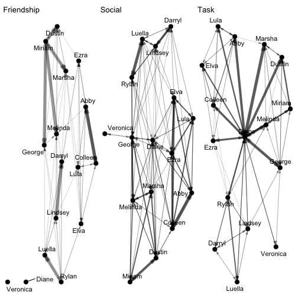
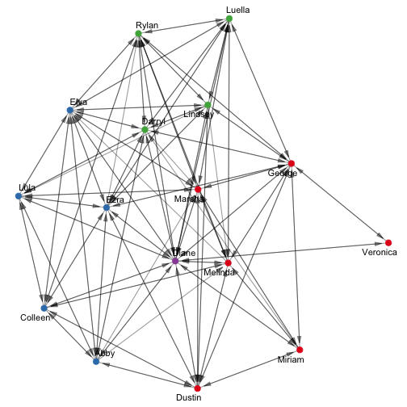
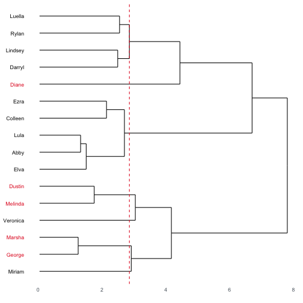
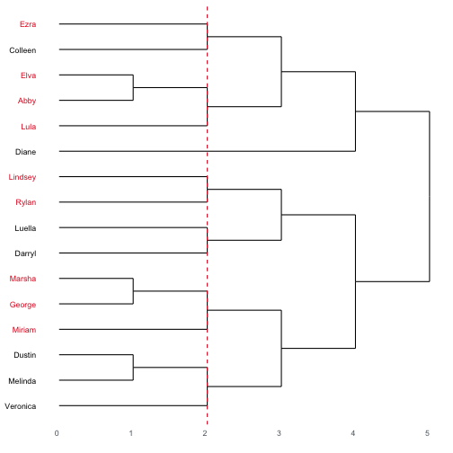
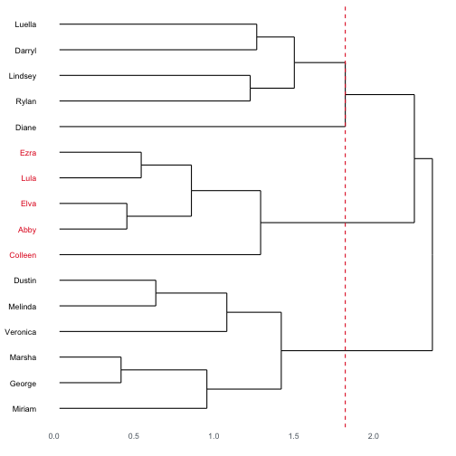
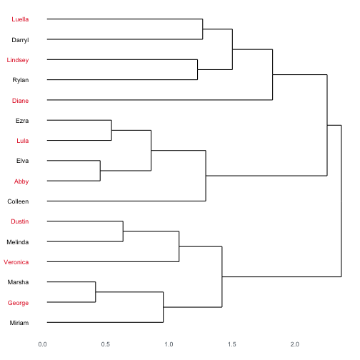
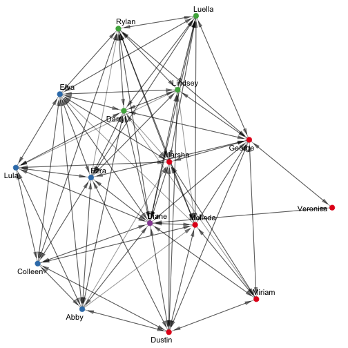
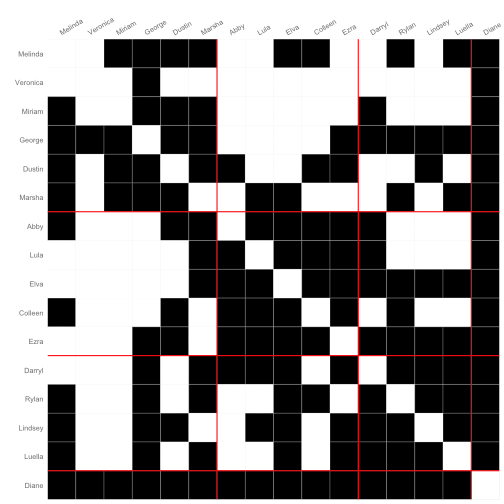

# Setting up

The data we're going to use here is included in the `{migraph}` package.
This dataset is multiplex, meaning that it contains 
several different types of ties: friendship, social and task interactions.


```r
library(migraph)
data("ison_algebra", package = "migraph")
# ?migraph::ison_algebra
```

Note that you do not need to load the package using `library()` to get the data.
Now you know how to create new matrices in R, load .csv files, 
saved .RData files, and data from packages!

## Separating multiplex networks

As a multiplex network, 
there are actually three different types of tie in this network.
We can extract them and investigate them separately using `to_uniplex()`:


```r
(friends <- to_uniplex(ison_algebra, "friends"))
#> # A tbl_graph: 16 nodes and 62 edges
#> #
#> # A directed simple graph with 3 components
#> #
#> # Node Data: 16 × 1 (active)
#>   name    
#>   <chr>   
#> 1 Melinda 
#> 2 Abby    
#> 3 Darryl  
#> 4 Veronica
#> 5 Rylan   
#> 6 Lindsey 
#> # … with 10 more rows
#> #
#> # Edge Data: 62 × 3
#>    from    to weight
#>   <int> <int>  <dbl>
#> 1     2     1      1
#> 2     2     7      1
#> 3     2     8      1
#> # … with 59 more rows
gfriend <- autographr(friends) + ggtitle("Friendship")
(social <- to_uniplex(ison_algebra, "social"))
#> # A tbl_graph: 16 nodes and 129 edges
#> #
#> # A directed simple graph with 1 component
#> #
#> # Node Data: 16 × 1 (active)
#>   name    
#>   <chr>   
#> 1 Melinda 
#> 2 Abby    
#> 3 Darryl  
#> 4 Veronica
#> 5 Rylan   
#> 6 Lindsey 
#> # … with 10 more rows
#> #
#> # Edge Data: 129 × 3
#>    from    to weight
#>   <int> <int>  <dbl>
#> 1     1     5   1.2 
#> 2     1     8   0.15
#> 3     1     9   2.85
#> # … with 126 more rows
gsocial <- autographr(social) + ggtitle("Social")
(tasks <- to_uniplex(ison_algebra, "tasks"))
#> # A tbl_graph: 16 nodes and 88 edges
#> #
#> # A directed simple graph with 1 component
#> #
#> # Node Data: 16 × 1 (active)
#>   name    
#>   <chr>   
#> 1 Melinda 
#> 2 Abby    
#> 3 Darryl  
#> 4 Veronica
#> 5 Rylan   
#> 6 Lindsey 
#> # … with 10 more rows
#> #
#> # Edge Data: 88 × 3
#>    from    to weight
#>   <int> <int>  <dbl>
#> 1     1     5    0.3
#> 2     1     9    0.3
#> 3     1    10    0.3
#> # … with 85 more rows
gtask <- autographr(tasks) + ggtitle("Task")
gfriend + gsocial + gtask
```



Note also that these are weighted networks.
`autographr()` automatically registers these different weights and plots them.

# Structural Holes and Constraint

Where might innovation be most likely to occur in these networks?
Let's take a look at which actors are least constrained 
by their position in the task network to begin with.
`{migraph}` makes this easy enough with the `node_constraint()` function.


```r
node_constraint(tasks)
#>   Melinda  Abby Darryl Veronica Rylan Lindsey  Lula
#> 1   0.930 0.877  0.664    0.987 0.611   0.609 0.900
#> # ... with 9 more from this nodeset in the vector.
```

We see that this function returns a vector of 
constraint scores that can range between 0 and 1.
Let's size the nodes according to this score,
and identify the node with the minimum constraint score.


```r
tasks <- tasks %>% mutate(low_constraint = node_is_min(node_constraint(tasks)))
autographr(tasks, node_color = "low_constraint")
```


Why minimum? And what can we learn from this plot
about where innovation might occur within this network?

# Structural Equivalence

Now we are going to identify and interpret the roles
or relations between a set of structurally equivalent positions.
We're going to identify structurally equivalent positions
across all the data that we have, including 'task', 'social', and 'friend' ties.

## Finding structurally equivalent classes

In `{migraph}`, finding how the nodes of a network can be partitioned
into structurally equivalent classes is as easy as:


```r
node_structural_equivalence(ison_algebra)
#> 1 
#>    Melinda, Veronica, Miriam, George, Dustin, Marsha
#>  2 
#>    Abby, Lula, Elva, Colleen, Ezra
#>  3 
#>    Darryl, Rylan, Lindsey, Luella
#>  4 
#>    Diane
ison_algebra %>% 
  mutate(se = node_structural_equivalence(ison_algebra)) %>% 
  autographr(node_color = "se")
```



But actually, a lot is going on behind the scenes here that we can unpack.

## Step one: starting with a census

All equivalence classes are based on nodes' similarity across some profile of motifs.
In `{migraph}`, we call these motif censuses.
Any kind of census can be used, and `{migraph}` includes a few options,
but `node_structural_equivalence()` is based off of the census of all the nodes' ties,
both outgoing and incoming ties, to reveal their relationships to tie partners.


```r
node_tie_census(ison_algebra)
#> # A tibble: 16 × 96
#>    fromMeli…¹ fromA…² fromD…³ fromV…⁴ fromR…⁵ fromL…⁶
#>         <dbl>   <dbl>   <dbl>   <dbl>   <dbl>   <dbl>
#>  1          0       1       0       0       1       1
#>  2          0       0       0       0       0       0
#>  3          0       0       0       0       1       2
#>  4          0       0       0       0       0       0
#>  5          0       0       1       0       0       1
#>  6          0       0       1       0       1       0
#>  7          0       1       0       0       0       1
#>  8          0       1       0       0       1       0
#>  9          0       0       0       0       0       0
#> 10          0       0       0       0       1       1
#> 11          0       0       1       0       2       1
#> 12          0       0       0       0       0       1
#> 13          0       2       0       0       0       0
#> 14          0       1       1       0       0       0
#> 15          0       0       1       0       0       0
#> 16          0       0       0       0       0       0
#> # … with 90 more variables: fromLula_friends <dbl>,
#> #   fromElva_friends <dbl>,
#> #   fromMiriam_friends <dbl>,
#> #   fromGeorge_friends <dbl>,
#> #   fromLuella_friends <dbl>,
#> #   fromDustin_friends <dbl>,
#> #   fromColleen_friends <dbl>, …
dim(node_tie_census(ison_algebra))
#> [1] 16 96
```

We can see that the result is a matrix of 16 rows
and 96 columns, 
because we want to catalogue or take a census of all the different incoming/outgoing partners 
our 16 nodes might have across these three networks.
Note also that the result is a weighted matrix; 
what would you do if you wanted it to be binary?

Note that `node_tie_census()` does not need to be passed to `node_structural_equivalence()` ---
this is done automatically --- 
but the more generic `node_equivalence()` can be used with whichever tie census is desired.
Feel free to explore using some of the other censuses available in `{migraph}`,
though some common ones are already used in the other equivalence convenience functions,
`node_regular_equivalence()` and `node_automorphic_equivalence()`.

## Step two: growing a tree of similarity

The next part is all done internally,
though there are several important parameters that can be set to obtain different results.

There are two main parameters that can be set here.
First, users can set the type of distance measure used.
This is passed on to `stats::dist()`, 
so that help page should be consulted for more details.
By default `"euclidean"` is used.

Second, we can also set the type of clustering algorithm employed.
By default, `{migraph}`'s equivalence functions use hierarchical clustering, `"hier"`,
but for compatibility and enthusiasts, we also offer `"concor"`,
which implements a CONCOR (CONvergence of CORrelations) algorithm.

We can see the difference from varying the clustering algorithm and/or distance
by plotting the dendrograms (hidden) in the output from `node_structural_equivalence()`:


```r
plot(node_structural_equivalence(ison_algebra, cluster = "hier", distance = "euclidean"))
```


```r
plot(node_structural_equivalence(ison_algebra, cluster = "hier", distance = "manhattan"))
```



```r
plot(node_structural_equivalence(ison_algebra, cluster = "concor"))
```



So plotting a `membership` vector from `{migraph}` returns a dendrogram
with the names of the nodes on the _y_-axis and the distance between them on the _x_-axis.
Using the census as material, the distances between the nodes
is used to create a dendrogram of (dis)similarity among the nodes.
Basically, as we move to the right, we're allowing for
more and more dissimilarity among those we cluster together.
A fork or branching point indicates the level of dissimilarity
at which those two or more nodes would be said to be equivalent.
Where two nodes' branches join/fork is the distance between them,
so more similar nodes' branches fork closer to the tree's canopy,
and less similar (groups of) nodes don't join until basically they form a trunk.

Note that with the results using the hierarchical clustering algorithm,
the distance directly affects the structure of the tree (and the results).

The CONCOR dendrogram is a bit different though.
Instead it represents how converging correlations repreatedly bifurcate 
the nodes into one of two partitions.
As such the 'distance' is really just the (inverse) number of steps
of bifurcations until nodes belong to the same class.

## Step three: identifying the number of clusters

Another bit of information represented in the dendrogram
is where the tree should be cut (the dashed red line) and
how the nodes are assigned to the branches (clusters) present at that cut-point.

But where does this red line come from?
Or, more technically, how do we identify the number of clusters
into which to assign nodes?

`{migraph}` includes several different ways of establishing `k`,
or the number of clusters.
Remember, the further to the right the red line is 
(the lower on the tree the cut point is)
the more dissimilar we're allowing nodes in the same cluster to be.
We could set this ourselves by just passing `k` an integer.


```r
plot(node_structural_equivalence(ison_algebra, k = 2))
```


But we're really just guessing. Maybe 2 is not the best `k`?
To establish that, we need to iterate through a number of potential `k`,
and consider their fitness by some metric.
There are a couple of options here.

One is to consider, for each `k`, how correlated this partition 
is with the observed network.
When there is one cluster for each vertex in the network, cell values will be
identical to the observed correlation matrix, and when there is one cluster 
for the whole network, the values will all be equal to the average correlation 
across the observed matrix.
So the correlations in each by-cluster matrix are correlated with the observed 
correlation matrix to see how well each by-cluster matrix fits the data.

Of course, the perfect partition would then be 
where all nodes are in their own cluster,
which is hardly 'clustering' at all.
Also, increasing `k` will always improve the correlation.
But if one were to plot these correlations as a line graph,
then we might expect there to be a relatively rapid increase
in correlation as we move from, for example, 3 clusters to 4 clusters,
but a relatively small increase from, for example, 13 clusters to 14 clusters.
By identifying the inflection point in this line graph,
`{migraph}` selects a number of clusters that represents a trade-off
between fit and parsimony.
This is the `k = "elbow"` method.

The other option is to evaluate a candidate for `k` based
not on correlation but on a metric of 
how similar each node in a cluster is to others in its cluster
_and_ how dissimilar each node is to those in a neighbouring cluster.
When averaged over all nodes and all clusters, 
this provides a 'silhouette coefficient' for a candidate of `k`.
Choosing the number of clusters that maximizes this coefficient,
which is what `k = "silhouette"` does,
can return a somewhat different result to the elbow method.
See what we have here, with all other arguments held the same:


```r
plot(node_structural_equivalence(ison_algebra, k = "elbow"))
```



```r
plot(node_structural_equivalence(ison_algebra, k = "silhouette"))
```


Ok, so it looks like the elbow method returns `k == 3` as a good trade-off
between fit and parsimony.
The silhouette method, by contrast, sees `k == 4` as maximising cluster similarity
and dissimilarity.
Either is probably fine here, 
and there is much debate around how to select the number of clusters anyway,
but the silhouette method seems to do a better job of identifying how unique
Diane is.
The silhouette method is also the default in `{migraph}`.

Note that there is a somewhat hidden parameter here, `range`.
Since testing across all possible numbers of clusters can get 
computationally expensive (not to mention uninterpretable) for large networks,
`{migraph}` only considers up to 8 clusters by default.
This however can be modified to be higher or lower, e.g. `range = 16`.

Finally, one last option is `k = "strict"`,
which only assigns nodes to the same partition 
if there is a distance of zero between them.
This is quick and rigorous solution,
however oftentimes this misses the point in finding clusters of nodes that, 
despite some variation, can be considered as similar on some dimension.


```r
plot(node_structural_equivalence(ison_algebra, k = "strict"))
```



Here for example, no two nodes have precisely the same tie-profile,
otherwise their branches would join/fork at a distance of 0.
As such, `k = "strict"` partitions the network into 16 clusters.
Where networks have a number of nodes with strictly the same profiles,
such a k-selection method might be helpful to recognise those in exactly the same structural position,
but here it essentially just reports nodes' identity.

# Blockmodelling

## Summarising profiles

Ok, so now we have a result from establishing nodes' membership in structurally equivalent classes.
We can graph this of course, as above:


```r
str_clu <- node_structural_equivalence(ison_algebra)
ison_algebra %>% 
  mutate(se = str_clu) %>% 
  autographr(node_color = "se")
```



While this plot enters the class information in to our earlier graph,
it doesn't always help us understand how the classes vary.

One option that can be useful for characterising what
the profile of ties (partners) is for each position/equivalence class
is to use `summary()`.
Used on a `node_motif` object, it also expects some membership vector,
and then it summarises the census by the partition assignment.
By default it takes the average of ties (values),
but this can be tweaked by assigning some other summary statistic as `FUN = `.


```r
summary(node_tie_census(ison_algebra),
        membership = str_clu)
#> # A tibble: 4 × 96
#>   fromMelin…¹ fromA…² fromD…³ fromV…⁴ fromR…⁵ fromL…⁶
#>         <dbl>   <dbl>   <dbl>   <dbl>   <dbl>   <dbl>
#> 1           0   0.167   0.167       0   0.333     0.5
#> 2           0   1       0.2         0   0.2       0.2
#> 3           0   0       0.75        0   1         1  
#> 4           0   0       0           0   0         0  
#> # … with 90 more variables: fromLula_friends <dbl>,
#> #   fromElva_friends <dbl>,
#> #   fromMiriam_friends <dbl>,
#> #   fromGeorge_friends <dbl>,
#> #   fromLuella_friends <dbl>,
#> #   fromDustin_friends <dbl>,
#> #   fromColleen_friends <dbl>, …
```

Since this node census produces 96 columns, 
$16 \text{nodes} * 2 \text{directions} * 3 \text{edge types}$,
it takes a bit to look through what varies between the different classes
as 'blocked'.

Another way to do this is to plot the blockmodel as a whole.
Passing the `plot()` function an adjacency/incidence matrix
along with a membership vector allows the matrix to be sorted and framed
(without the membership vector, just the adjacency/incidence matrix is plotted):


```r
plot(as_matrix(ison_algebra),
     membership = str_clu)
```



So, with this information, we might characterise them like so:

- Melinda, Veronica, Miriam, George, Dustin, Marsha work together only in reciprocal pairs on tasks,
preferring to approach Diane but also those of the other two roles.
While they hang out with each other socially quite a bit, friendship from groups 2 and 3 are preferred.
We shall call them *freaks*.
- Abby, Lula, Elva, Colleen, Ezra also work together only in reciprocal pairs,
preferring to work collaboratively with group 1 or also Diane.
They also tend to count those from group 1 as friends,
and hang out with everyone else but themselves.
We shall call them *squares*.
- Darryl, Rylan, Lindsey, Luella will work with either some in group 1 and 3, or 2,
but again prefer Diane for task advice.
They are pretty good friends with each other though,
and pretty happy to socialise with everyone.
We shall call them *nerds*.
- Diane is a loner, no friends,
but everyone hangs out with them for task advice, therefore the *geek*.

## Reduced graph

Lastly, we can consider how _classes_ of nodes relate to one another in a blockmodel.
Let's use the 4-cluster solution on the valued network (though binary is possible too).


```r
str_clu <- node_structural_equivalence(ison_algebra)
(bm <- to_blocks(ison_algebra, str_clu))
#> # A tbl_graph: 4 nodes and 15 edges
#> #
#> # A directed multigraph with 1 component
#> #
#> # Node Data: 4 × 1 (active)
#>   name   
#>   <chr>  
#> 1 Block 1
#> 2 Block 2
#> 3 Block 3
#> 4 Block 4
#> #
#> # Edge Data: 15 × 3
#>    from    to weight
#>   <int> <int>  <dbl>
#> 1     1     1  0.611
#> 2     1     2  0.267
#> 3     1     3  0.417
#> # … with 12 more rows
bm <- bm %>% as_tidygraph %>% mutate(name = c("Freaks", "Squares", "Nerds", "Geek"))
autographr(bm)
```


# Unit Test

1. Plot labelled, reduced graph of STURCTURALLY equivalent classes 
on the `mpn_elite_usa_advice` network and interpret

2. Plot labelled, reduced graph of REGULARLY equivalent classes 
on the `mpn_elite_usa_advice` network and interpret

3. Plot labelled, reduced graph of AUTOMORPHICALLY equivalent classes 
on the `mpn_elite_usa_advice` network only and interpret
