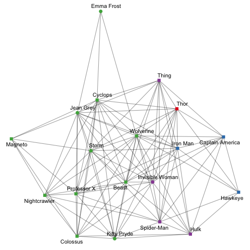
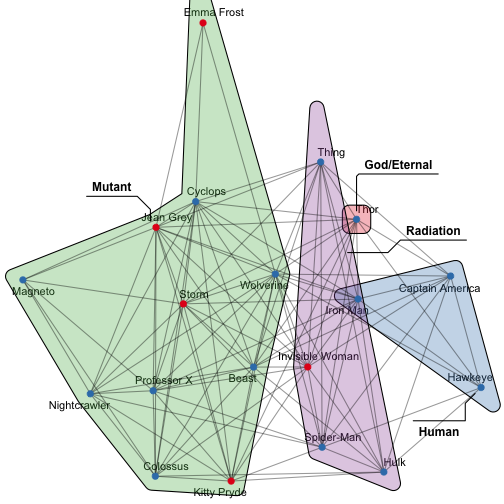
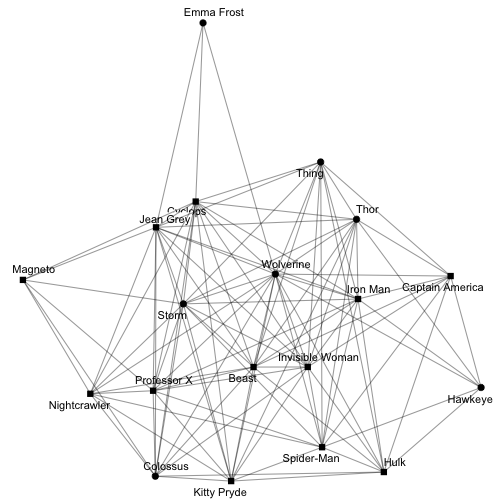
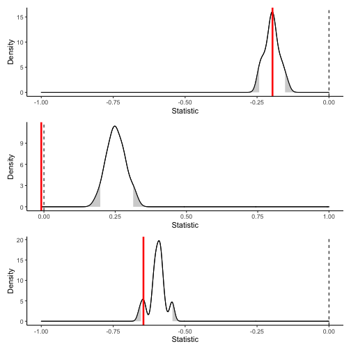
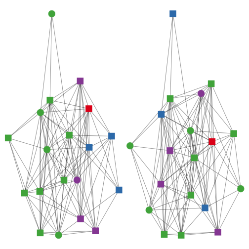
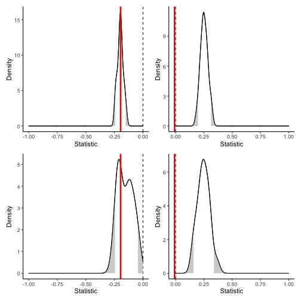
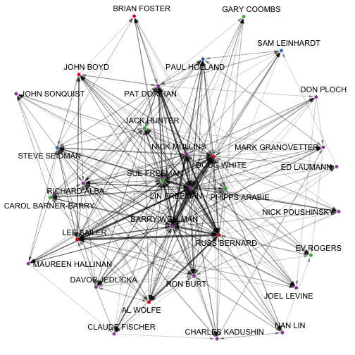
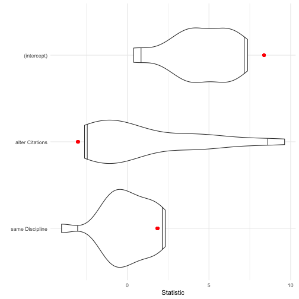

# Setting up

For this session, we'll explore a couple of different datasets.

First, let's examine homogeneity/heterogeneity in the Marvel relationships dataset.
The dataset included in the package is quite complicated,
so to make this simpler, let's concentrate on:

- just the positive (friendship) ties and not the negative (enmity) ties
- the main component without any isolates
- just those characters that appear in the comics more than average

Fortunately, all these data cleaning moves are easy to do in `{migraph}`,
and can be seen in the following chunk in order:


```r
library(migraph)
marvel_friends <- to_unsigned(ison_marvel_relationships, keep = "positive")
marvel_friends <- to_giant(marvel_friends)
marvel_friends <- marvel_friends %>% to_subgraph(Appearances >= mean(Appearances))
marvel_friends
#> # A tbl_graph: 19 nodes and 107 edges
#> #
#> # An undirected simple graph with 1 component
#> #
#> # Node Data: 19 × 10 (active)
#>   name  Gender Appear… Attrac…  Rich
#>   <chr> <chr>    <int>   <int> <int>
#> 1 Beast Male      7609       1     0
#> 2 Capt… Male      9000       1     0
#> 3 Colo… Male      5974       1     0
#> 4 Cycl… Male      8853       1     0
#> 5 Emma… Female    4777       1     0
#> 6 Hawk… Male      3982       1     0
#> # … with 13 more rows, and 5 more
#> #   variables: Intellect <int>,
#> #   Omnilingual <int>, PowerOrigin <chr>,
#> #   UnarmedCombat <int>,
#> #   ArmedCombat <int>
#> #
#> # Edge Data: 107 × 2
#>    from    to
#>   <int> <int>
#> 1     1     2
#> 2     1     3
#> 3     1     4
#> # … with 104 more rows
```

This gives us a dataset of nearly twenty characters and a little more than 100 edges.
Recall that this data has several nodal attributes.
Let's explore a couple of these attributes visually.


```r
autographr(marvel_friends, 
           node_shape = "Gender",
           node_color = "PowerOrigin")
```



These variables seem to be distributed unevenly across the network.
There seems to be some homophily, or like choosing like,
operating here, but it is difficult to tell because there are
clearly more male than female superheros shown here,
as well as clearly more superheros of mutant origin than others.
To get started then, we need to establish how diverse this network is really.

# Calculating diversity

## Calculating Blau index

We can begin by calculating the Blau diversity for each attribute.
Recall that the Blau index for any given diversity variable is:

$$1 - \sum p_i^2$$

where $p$ represents the proportion belonging to any given category,
and $i$ indexes each of the given categories.
As such a perfectly homogeneous group would receive a score of 0,
while a perfectly heterogeneous group (with members spread evenly over the maximum categories)
would receive a score of 1.


```r
graph_diversity(marvel_friends, "Gender")
#> [1] 0.388
graph_diversity(marvel_friends, "PowerOrigin")
#> [1] 0.593
graph_diversity(marvel_friends, "Attractive")
#> [1] 0.188
graph_diversity(marvel_friends, "Rich")
#> [1] 0.188
graph_diversity(marvel_friends, "Intellect")
#> [1] 0.465
```

Looks like there is more diversity in terms of where these characters got
their powers, whether they have significant intellectual powers,
and their gender, than their attractiveness or their wealth.

We can also cross-reference this diversity.
For example, we might be interested in whether our comic book heroes
are equally gender diverse across their (power) origin stories,
or equally intellectually diverse across gender.^[Note that this works for calculated categorical variables too, such as cluster/group assignment from community detection or equivalence classes.]


```r
graph_diversity(marvel_friends, "Gender", "PowerOrigin")
#> [1] 0.000 0.000 0.463 0.375
graph_diversity(marvel_friends, "Intellect", "Gender")
#> [1] 0.480 0.459
```

Note that the length of the vector returned as a result
is the number of categories in the second category listed.
It looks like some origin stories are much more diverse than others.
Gods (just Thor here) and humans are all men,
whereas those with mutant or radiation origin stories are more gender diverse.
There doesn't seem to be any significant difference in intellect 
across gender categories however.
We can visualise this quite effectively using the `node_groups` argument:


```r
autographr(marvel_friends, 
           node_group = "PowerOrigin", 
           node_color = "Gender")
```



```r
autographr(marvel_friends, 
           node_color = "Gender", 
           node_size = "Intellect")
```



Ok, this tells us about how (un)even the distribution of these variables is in this network,
but it doesn't necessarily tell us whether within this network there is homophily/heterophily.

## Calculating EI index

A step in this direction is to calculate the EI (or E-I) index.
Calculating the EI index follows the same syntax.
Recall that the EI index is calculated as:

$$\frac{E-I}{E+I}$$

where $E$ is the number of ties present between a variable's categories (i.e. external),
and $I$ is the number of ties present within a variable's categories (i.e. internal).
As such, an EI index of -1 suggests perfect homophily, whereas an EI index of +1 suggests perfect heterophily.


```r
(obs.gender <- graph_homophily(marvel_friends, "Gender"))
#> [1] -0.196
(obs.powers <- graph_homophily(marvel_friends, "PowerOrigin")) 
#> [1] -0.00935
(obs.attract <- graph_homophily(marvel_friends, "Attractive")) 
#> [1] -0.645
```

Looks like there might be some gender homophily present,
but the score for power origin homophily is so close to 0 that
it does not seem to signal much.
There seems to be a fairly large effect for homophily on the basis of looks though...

Ultimately though, these are just scores,
and doesn't tell us whether this is any more or less than
what we might expect the score to be by chance for a network
of this size and density and distribution of that attribute.

# Testing scores

## Conditional uniform graph tests

To see whether we should be surprised by a score this high/low, 
we will simulate a series of random graphs
(Erdös-Renyi/Bernoulli) of the same dimensions and
distribution of the attribute to find out whether there is
more homophily or heterophily than expected by chance.

This is called a conditional uniform graph test,
but `{migraph}` chooses more descriptive function names,
such as `test_random()`:


```r
rand.gender <- test_random(marvel_friends, 
                            graph_homophily, attribute = "Gender", 
                           times = 20)
rand.power <- test_random(marvel_friends, 
                           graph_homophily, attribute = "PowerOrigin", 
                           times = 20)
rand.attract <- test_random(marvel_friends, 
                             graph_homophily, attribute = "Attractive", 
                           times = 20)
plot(rand.gender) / 
plot(rand.power) /
plot(rand.attract)
```



The plots of these results use a dotted vertical line for 0 where this is in bounds,
a red vertical line for the observed score,
and a density plot of the scores from the randomly generated networks.
The grey tails of the distribution are a visual aid indicating the most extreme 5% of scores
from the distribution.

The results are _really_ interesting.
Despite being the larger coefficients (in absolute terms),
it looks like we cannot reject the null hypothesis that there is no homophily
for gender nor for attractiveness.
Both observed scores fall within the range of scores we would expect from
randomly generated networks with the same distribution of that variable.

However, we can reject the null hypothesis with respect to their power origin story.
While the coefficient itself is close to 0 (neither strong homophily nor heterophily),
all the random networks generated returned larger EI scores, between .1 and .4.
That is, there is significantly less heterophily here than expected.

## Quadratic assignment procedure tests

Ah, but perhaps the random graph is not the best reference group 
for establishing whether there is a significant homophily effect here.
After all, social networks are not completely random; they are structured.

Another approach is to use permutations of the network.
Permuting the network retains the structure of the network, 
but reassigns any labels (variables) randomly.
Let's first plot the observed data and some permuted data next to each other.


```r
old <- autographr(marvel_friends, 
                  labels = FALSE, node_size = 6, 
                  node_color = "PowerOrigin", 
                  node_shape = "Gender")
new <- autographr(generate_permutation(marvel_friends, with_attr = TRUE),
                   labels = FALSE, node_size = 6,
                  node_color = "PowerOrigin",
                  node_shape = "Gender")
old + new
```



This single permutation suggests there might otherwise be some more even mixing of these
attributes, but it is just a single permutation.
Let's try a test that runs this over a succession of permutations,
just as we did with random graphs.


```r
perm.gender <- test_permutation(marvel_friends, 
                                graph_homophily, attribute = "Gender",
                                times = 1000)
perm.power <- test_permutation(marvel_friends, 
                               graph_homophily, attribute = "PowerOrigin",
                                times = 1000)
```

Again, we see that there is perhaps nothing so surprising that we got the homophily score
for gender that we did, but the lack of power origin heterophily is surprising.


```r
(plot(rand.gender) | plot(rand.power)) /
(plot(perm.gender) | plot(perm.power))
```



Note how the distributions are generally wider when permuting the observed network 
than creating a random distribution (be mindful of the scale of the _x_-axis).
That is, taking into account the structure of the network leads us to
expect a larger spread in the EI index than when the variable is distributed around a random network.

# Network linear models

Next let us examine homophily in another network.
The data were collected as part of an early experiment on communication between social network researchers who were using an Electronic Information Exchange System (EIES).
You may recognise some of the names.
The main network consists of 32 scholars with directed ties weighted by the total number of messages sent from $i$ to $j$ over the period of the study.
Nodal attributes collected include the primary discipline and number of citations in the social science citation index at the start of the study.


```r
ison_networkers
#> # A tbl_graph: 32 nodes and 440 edges
#> #
#> # A directed simple graph with 1 component
#> #
#> # Node Data: 32 × 3 (active)
#>   name               Discipline   Citatio…
#>   <chr>              <chr>           <dbl>
#> 1 LIN FREEMAN        Sociology          19
#> 2 DOUG WHITE         Anthropology        3
#> 3 EV ROGERS          Other             170
#> 4 RICHARD ALBA       Sociology          23
#> 5 PHIPPS ARABIE      Other              16
#> 6 CAROL BARNER-BARRY Other               6
#> # … with 26 more rows
#> #
#> # Edge Data: 440 × 3
#>    from    to weight
#>   <int> <int>  <dbl>
#> 1     1     2    488
#> 2     1     3     28
#> 3     1     4     65
#> # … with 437 more rows
autographr(ison_networkers,
           node_color = "Discipline")
```



Let's use both the continuous `Citations` and the categorical `Discipline` variables 
and come up with a couple of key hypotheses:

- $H_1$: whether these researchers send more emails to those who are cited more
- $H_2$: whether there is disciplinary homophily

Let's start with a pretty maximally specified model 
(note that it doesn't make sense to include both ego and alter effects because these are undirected):


```r
model1 <- network_reg(weight ~ alter(Citations) + sim(Citations) + 
                      alter(Discipline) + same(Discipline), 
                      ison_networkers, times = 200)
```

We can use tidy methods to get the salient information from this model,
and `{migraph}` includes also a plot method for these results to
facilitate the quick interpretation of these results.


```r
tidy(model1)
#> # A tibble: 7 × 4
#>   term            estimate stati…¹ p.value
#>   <chr>              <dbl>   <dbl>   <dbl>
#> 1 (intercept)       1.72     0.194   0.91 
#> 2 alter Citations  -0.0326  -0.588   0.58 
#> 3 sim Citations    24.4      2.86    0.235
#> 4 alter Discipli… -16.8     -3.07    0.29 
#> 5 alter Discipli… -10.6     -2.31    0.475
#> 6 alter Discipli…  -7.37    -1.90    0.575
#> 7 same Discipline   3.90     1.23    0.395
#> # … with abbreviated variable name
#> #   ¹​statistic
glance(model1)
#> # A tibble: 1 × 8
#>   r.squared adj.r.…¹ sigma stati…² p.value
#>       <dbl>    <dbl> <dbl>   <dbl>   <dbl>
#> 1    0.0334   0.0275  43.1    5.67 8.33e-6
#> # … with 3 more variables: df <dbl>,
#> #   df.residual <int>, nobs <int>, and
#> #   abbreviated variable names
#> #   ¹​adj.r.squared, ²​statistic
plot(model1)
```



This voilin plot presents the distribution of coefficients from permutations of the network,
with the fitted coefficient from the data as a red dot.
Subtle lines are used to indicate 95%,
but here the distributions are rendered so wide that they are often not seen.

Hmm, looks like we can't say much from this fit:
the fitted coefficients are, if not typical, at least unsurprising
from permutations of the network and so there's no evidence 
for rejecting our hypotheses in this data.
