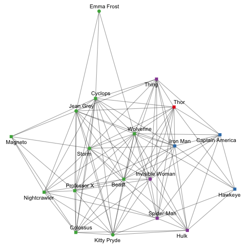
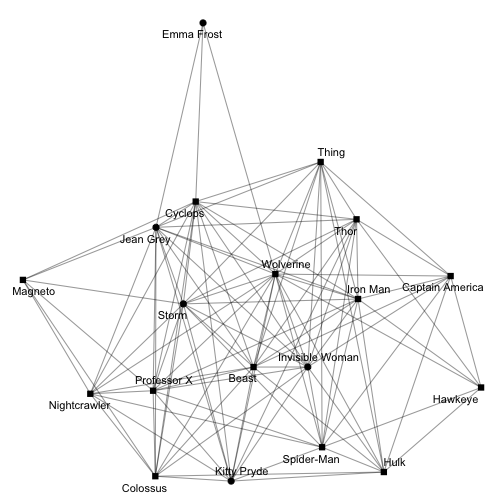
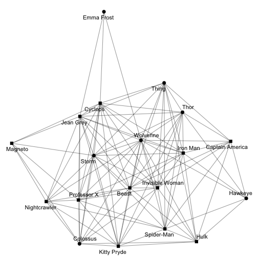
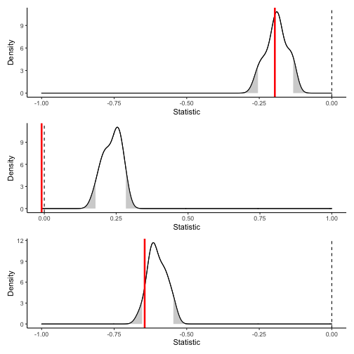
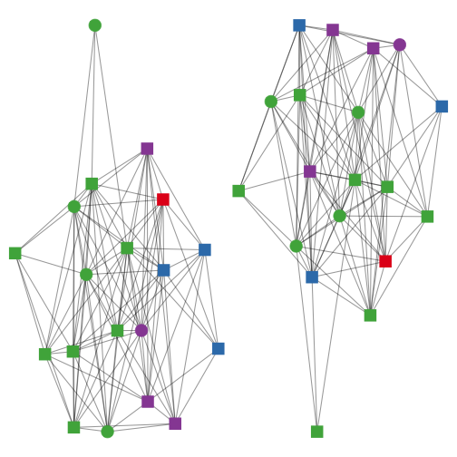
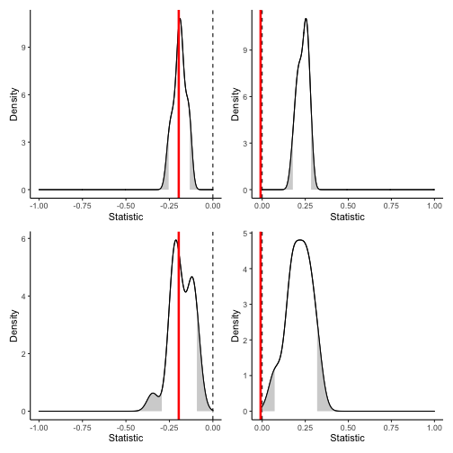
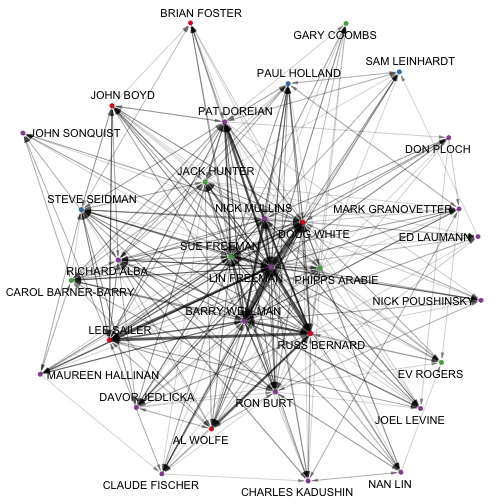
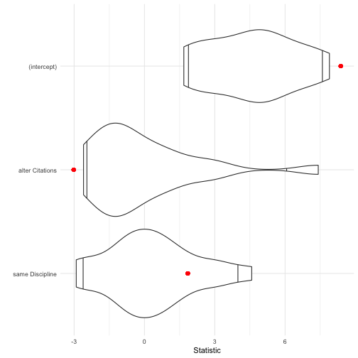

# Setting up

For this lab, we'll explore a couple of different datasets.
First, let's examine heterogeneity within the Marvel relationships dataset.
Since this is a signed network, let's first extract just the friendships.
We'll also concentrate on just the main component (no isolates).
And, for the sake of simplicity, just the characters that appear
in the comics more than average for these characters.


```r
library(migraph)
marvel_friends <- to_unsigned(ison_marvel_relationships, keep = "positive")
marvel_friends <- to_giant(marvel_friends)
marvel_friends <- marvel_friends %>% to_subgraph(Appearances >= mean(Appearances))
marvel_friends
#> # A tbl_graph: 19 nodes and 107 edges
#> #
#> # An undirected simple graph with 1 component
#> #
#> # Node Data: 19 × 10 (active)
#>   name  Gender Appear… Attrac…  Rich Intell… Omnili…
#>   <chr> <chr>    <int>   <int> <int>   <int>   <int>
#> 1 Beast Male      7609       1     0       1       0
#> 2 Capt… Male      9000       1     0       1       0
#> 3 Colo… Male      5974       1     0       0       0
#> 4 Cycl… Male      8853       1     0       1       0
#> 5 Emma… Female    4777       1     0       0       1
#> 6 Hawk… Male      3982       1     0       0       0
#> # … with 13 more rows, and 3 more variables:
#> #   PowerOrigin <chr>, UnarmedCombat <int>,
#> #   ArmedCombat <int>
#> #
#> # Edge Data: 107 × 2
#>    from    to
#>   <int> <int>
#> 1     1     2
#> 2     1     3
#> 3     1     4
#> # … with 104 more rows
```

This gives us a dataset of nearly twenty characters and a little more than 100 edges.
Recall that this data has several nodal attributes.
Let's explore a couple of these attributes visually.


```r
autographr(marvel_friends, 
           node_shape = "Gender",
           node_color = "PowerOrigin")
```



There seems to be a bit of a distribution of some of these variables.

# Calculating diversity

## Calculating Blau index

We can begin by calculating the Blau diversity for each attribute.
Recall that the Blau index for any given diversity variable is:

$$1 - \sum p_i^2$$

where $p$ represents the proportion belonging to any given category,
and $i$ indexes each of the given categories.
As such a perfectly homogeneous group would receive a score of 0,
while a perfectly heterogeneous group (with members spread evenly over the maximum categories)
would receive a score of 1.


```r
graph_blau_index(marvel_friends, "Gender")
#> [1] 0.388
graph_blau_index(marvel_friends, "PowerOrigin")
#> [1] 0.593
graph_blau_index(marvel_friends, "Attractive")
#> [1] 0.188
graph_blau_index(marvel_friends, "Rich")
#> [1] 0.188
graph_blau_index(marvel_friends, "Intellect")
#> [1] 0.465
```

Looks like there is more diversity in terms of where these characters got
their powers, whether they have significant intellectual powers,
and their gender, than their attractiveness or their wealth.

We can also cross-reference this diversity.
For example, we might be interested in whether our comic book heroes
are equally gender diverse across their (power) origin stories,
or equally intellectually diverse across gender.^[Note that this works for calculated categorical variables too, such as cluster/group assignment from community detection or equivalence classes.]


```r
graph_blau_index(marvel_friends, "Gender", "PowerOrigin")
#> [1] 0.000 0.000 0.463 0.375
graph_blau_index(marvel_friends, "Intellect", "Gender")
#> [1] 0.480 0.459
```

Looks like some origin stories are much more diverse than others.
Gods (just Thor here) and humans are all men,
whereas those with mutant or radiation origin stories are more gender diverse.
There doesn't seem to be any significant difference in intellect 
across gender categories however.
We can visualise this quite effectively using the `node_groups` argument:


```r
autographr(marvel_friends, 
           node_group = "PowerOrigin", 
           node_shape = "Gender")
```



```r
autographr(marvel_friends, 
           node_group = "Gender", 
           node_shape = "Intellect")
```



## Calculating EI index

Calculating the EI index follows the same syntax.
Recall that the EI index is calculated as:

$$\frac{E-I}{E+I}$$

where $E$ is the number of ties present between a variable's categories (i.e. external),
and $I$ is the number of ties present within a variable's categories (i.e. internal).
As such, an EI index of -1 suggests perfect homophily, whereas an EI index of +1 suggests perfect heterophily.


```r
(obs.gender <- graph_ei_index(marvel_friends, "Gender"))
#> [1] -0.196
(obs.powers <- graph_ei_index(marvel_friends, "PowerOrigin")) 
#> [1] -0.00935
(obs.attract <- graph_ei_index(marvel_friends, "Attractive")) 
#> [1] -0.645
```

Looks like there might be some gender homophily present,
but the score for power origin homophily is so close to 0 that
it does not seem to signal much.
There seems to be a fairly large effect for homophily on the basis of looks though...

But ultimately these are just scores,
and this doesn't tell us whether this is any more or less than
what we might expect the score to be by chance for a network
of this size and density and distribution of that attribute.

# Testing scores

## Conditional uniform graph tests

To get at that, we will simulate a series of random graphs
(Erdös-Renyi/Bernoulli) of the same dimensions and
distribution of the attribute to find out whether there is
more homophily or heterophily than expected by chance.


```r
rand.gender <- test_random(marvel_friends, 
                            graph_ei_index, attribute = "Gender", 
                           times = 20)
rand.power <- test_random(marvel_friends, 
                           graph_ei_index, attribute = "PowerOrigin", 
                           times = 20)
rand.attract <- test_random(marvel_friends, 
                             graph_ei_index, attribute = "Attractive", 
                           times = 20)
plot(rand.gender) / 
plot(rand.power) /
plot(rand.attract)
```



This is really interesting.
It looks like we cannot reject the null hypothesis that there is no homophily
for gender nor for attractiveness,
but we can reject the null hypothesis with respect to their power origin story.
While the effect itself is close to 0 (neither strong homophily nor heterophily),
all the random networks generated returned larger EI scores, between .1 and .4.
So there is significantly less heterophily here than expected.

## Quadratic assignment procedure tests

But perhaps the random graph is not the best reference group for establishing whether
there is a significant homophily effect here.
Another approach is to use permutations of the network.
Permuting the network retains the structure of the network, 
but reassigns any labels (variables) randomly.
Let's first plot the observed data and some permuted data next to each other.


```r
old <- autographr(marvel_friends, 
                  labels = FALSE, node_size = 6, 
                  node_color = "PowerOrigin", 
                  node_shape = "Gender")
new <- autographr(generate_permutation(marvel_friends, with_attr = TRUE),
                   labels = FALSE, node_size = 6,
                  node_color = "PowerOrigin",
                  node_shape = "Gender")
old + new
```



This single permutation suggests there might otherwise be some more even mixing of these
attributes, but it is just a single permutation.
Let's try a test that runs this over a succession of permutations,
just as we did with random graphs.


```r
perm.gender <- test_permutation(marvel_friends, 
                                graph_ei_index, attribute = "Gender",
                                times = 20)
perm.power <- test_permutation(marvel_friends, 
                               graph_ei_index, attribute = "PowerOrigin",
                                times = 20)
```

Again, we see that there is perhaps nothing so surprising that we got the homophily score
for gender that we did, but the lack of power origin heterophily is surprising.


```r
(plot(rand.gender) | plot(rand.power)) /
(plot(perm.gender) | plot(perm.power))
```



Note how distributions are generally wider when permuting the observed network 
than creating a random distribution.
That is, we expect a larger spread in the EI index for a network of this structure.

# Network linear models

Next let us examine another network and see to what degree homophily plays a role.
Here we are going to use the EIES dataset.
The data were collected as part of an early experiment on communication between social network researchers who were using an Electronic Information Exchange System (EIES).
The main network consists of 32 scholars with directed ties weighted by the total number of messages sent from $i$ to $j$ over the period of the study.
Nodal attributes collected include the primary discipline and number of citations in the social science citation index at the start of the study.


```r
ison_networkers
#> # A tbl_graph: 32 nodes and 440 edges
#> #
#> # A directed simple graph with 1 component
#> #
#> # Node Data: 32 × 3 (active)
#>   name               Discipline   Citations
#>   <chr>              <chr>            <dbl>
#> 1 LIN FREEMAN        Sociology           19
#> 2 DOUG WHITE         Anthropology         3
#> 3 EV ROGERS          Other              170
#> 4 RICHARD ALBA       Sociology           23
#> 5 PHIPPS ARABIE      Other               16
#> 6 CAROL BARNER-BARRY Other                6
#> # … with 26 more rows
#> #
#> # Edge Data: 440 × 3
#>    from    to weight
#>   <int> <int>  <dbl>
#> 1     1     2    488
#> 2     1     3     28
#> 3     1     4     65
#> # … with 437 more rows
autographr(ison_networkers,
           node_color = "Discipline")
```



Let's use both the continuous `Citations` and the categorical `Discipline` variables and come up with a couple of key hypotheses:

- whether these researchers send more emails to those who are cited more
- whether there is disciplinary homophily

Let's start with a pretty maximally specified model (note that it doesn't make sense to include both ego and alter effects because these are undirected :


```r
model1 <- network_reg(weight ~ alter(Citations) + same(Discipline), 
                      ison_networkers, times = 20)
```

We can use tidy methods to get the salient information from this model,
and `{migraph}` includes also a plot method for these results to
facilitate the quick interpretation of these results.


```r
tidy(model1)
#> # A tibble: 3 × 4
#>   term            estimate statistic p.value
#>   <chr>              <dbl>     <dbl>   <dbl>
#> 1 (intercept)       16.3        8.38     0  
#> 2 alter Citations   -0.132     -3.02     0.1
#> 3 same Discipline    5.40       1.85     0.3
glance(model1)
#> # A tibble: 1 × 8
#>   r.squared adj.r.…¹ sigma stati…² p.value    df df.re…³
#>       <dbl>    <dbl> <dbl>   <dbl>   <dbl> <dbl>   <int>
#> 1    0.0120   0.0100  43.5    6.03 0.00250     2     989
#> # … with 1 more variable: nobs <int>, and abbreviated
#> #   variable names ¹​adj.r.squared, ²​statistic,
#> #   ³​df.residual
plot(model1)
```




Hmm, looks like we can't say much from this fit.
You can try and increase the number of `times` we permute,
but it's unlike to make much difference.
